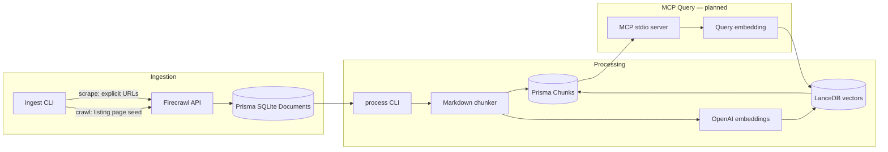

# 🧠 Agentic Knowledge Engine (AKE)

A local-first RAG pipeline for indie hacker research. Scrape startup case studies from the web, chunk and embed them, then query that knowledge from Cursor or Claude via MCP.

## 💡 What the project is

AKE is a personal knowledge engine built for founders and researchers who want AI assistants grounded in real startup stories — not generic training data.

The pipeline works in three stages:

1. **📥 Ingest** — Firecrawl scrapes web pages (single URLs or full site crawls) and stores clean markdown in a local SQLite database.
2. **⚙️ Process** — Documents are chunked into searchable segments, embedded via OpenAI, and stored in LanceDB.
3. **🔍 Query** — An MCP server exposes a search tool so Cursor or Claude can retrieve relevant case-study chunks when you ask questions. *(planned)*

Everything runs locally. Your scraped content, embeddings, and vectors stay on your machine under `data/`. 🔒

## ✨ Features

### ✅ Implemented

- **🌐 Single-URL scraping** — Ingest one or more case-study URLs into the `Document` table.
- **🕷️ Site crawling** — Pass a listing-page seed URL and automatically discover and scrape linked pages (`--crawl` mode).
- **📄 Main-content extraction** — Firecrawl requests markdown with `onlyMainContent: true` to strip nav, footers, and sidebars.
- **🔄 Document upsert** — New URLs are saved as `pending`. Re-scraping a `pending` document updates markdown for re-processing. **`processed` documents are skipped by default** (use `--force` to re-scrape).
- **✂️ Markdown-aware chunking** — `process` CLI splits pending documents into ~450-word chunks (max ~550), respecting headings, paragraphs, and fenced code blocks.
- **🧮 OpenAI embedding pipeline** — `process` embeds chunks via `text-embedding-3-small` in batches of 100, with automatic rate-limit retries, and writes 1536-dim vectors to LanceDB.
- **🗄️ Hybrid storage** — Prisma/SQLite for document and chunk metadata; LanceDB for 1536-dim embedding vectors.
- **👀 Prisma Studio** — Inspect documents and chunks via `npm run studio`.
- **🔎 LanceDB inspection** — `npm run inspect:lancedb` prints vector counts and sample rows from the `chunk_vectors` table.

### 🚧 Planned

- 🔌 MCP stdio server with `search_scraped_data` tool
- 🤖 Cursor MCP integration for end-to-end querying

## 📁 Project structure

```
GeneralizedKnowledgeEngine/
├── prisma/
│   ├── schema.prisma          # Document + Chunk models (SQLite)
│   └── migrations/            # Database migrations
├── src/
│   ├── lib/
│   │   ├── db.ts              # Prisma client singleton
│   │   ├── firecrawl.ts       # Scrape + crawl wrappers
│   │   ├── chunker.ts         # Markdown-aware text splitting
│   │   ├── embeddings.ts      # OpenAI embed + batch helper
│   │   └── lancedb.ts         # LanceDB table init + vector helpers
│   ├── ingest.ts              # CLI: scrape URLs or crawl a site
│   ├── process.ts             # CLI: chunk + embed pending documents
│   ├── inspect-lancedb.ts     # CLI: inspect LanceDB vector table
│   └── init.ts                # Bootstrap DB + vector store
├── data/                      # gitignored — local SQLite + LanceDB files
│   ├── ake.db
│   └── lancedb/
├── .env.example               # Environment variable template
├── package.json
├── tsconfig.json
└── README.md
```

## 🏗️ Architecture



**Design choice:** Prisma/SQLite owns document and chunk text/metadata. LanceDB owns vectors keyed by `chunkId`. The two stores are linked by chunk ID — Prisma handles relational tracking; LanceDB handles fast similarity search.

## 🗃️ Data model

| Model | Key fields | Purpose |
|-------|-----------|---------|
| `Document` | `sourceUrl`, `title`, `markdown`, `status`, `scrapedAt`, `processedAt` | Scraped page content |
| `Chunk` | `documentId`, `content`, `chunkIndex`, `tokenEstimate`, `embeddedAt` | Text segments for embedding |
| `chunk_vectors` (LanceDB) | `chunkId`, `documentId`, `sourceUrl`, `vector` | 1536-dim embeddings for search |

Document status flow: `pending` → `processed` (or `failed`). Once a document is `processed`, ingest skips it by default; `process` only chunks `pending` documents.

## 📋 Prerequisites

- **Node.js 22+** (required by `@mendable/firecrawl-js`)
- **[Firecrawl](https://firecrawl.dev) API key** — free tier is sufficient for development (~1 credit per page)
- **[OpenAI](https://platform.openai.com) API key** — for `text-embedding-3-small` (required for `process`)

## 🚀 Setup

```bash
npm install
cp .env.example .env
# Edit .env and add your API keys
npx prisma migrate dev
npm run init
```

## 📖 Usage

### 🌐 Scrape individual URLs

```bash
npm run ingest -- https://www.indiehackers.com/post/example https://www.starterstory.com/stories/example
```

**Default behavior:** If a URL already exists with `status: processed`, ingest skips it (no Firecrawl call, no DB update). URLs with `status: pending` are re-scraped and updated.

**Force re-scrape:** Pass `--force` to update all URLs regardless of status. Markdown is refreshed and status is reset to `pending` for re-chunking.

```bash
npm run ingest -- --force https://www.indiehackers.com/post/example
```

### 🕷️ Crawl a listing page

Discover and scrape linked case-study pages from a seed URL:

```bash
npm run ingest -- --crawl https://www.indiehackers.com/group/tech --limit 20
npm run ingest -- --crawl https://www.indiehackers.com/group/tech --limit 20 --force
```

Crawl options:

| Flag | Description |
|------|-------------|
| `--force` | Re-scrape and update documents even if already `processed` |
| `--limit N` | Max pages to scrape (default: 50, hard-capped during development) |
| `--include pattern` | Only follow URLs matching this path pattern (repeatable) |
| `--exclude pattern` | Skip URLs matching this path pattern (repeatable) |
| `--depth N` | Max link-discovery depth from the seed URL |

During a crawl, already-`processed` pages are skipped at save time unless `--force` is set. Firecrawl may still fetch those pages (using credits); use `--include` / `--exclude` to narrow discovery.

### ✂️ Chunk and embed pending documents

Split `pending` documents into chunks (~450 words each, max ~550), embed them via OpenAI in batches of 100, write vectors to LanceDB, and mark documents `processed`. Documents with `status: processed` are not touched.

```bash
npm run process
```

When re-processing a `pending` document, existing chunks and LanceDB vectors for that document are deleted first. If embedding fails for a document (e.g. invalid API key), its status is set to `failed`. Re-scrape with `--force` and run `process` again to retry.

### 👀 Inspect the database

```bash
npm run studio
```

Opens Prisma Studio in the browser. For long markdown fields, export via SQLite CLI:

```bash
sqlite3 data/ake.db "SELECT markdown FROM Document LIMIT 1;" > preview.md
```

### 🔎 Inspect LanceDB vectors

```bash
npm run inspect:lancedb
```

Prints the total vector count (excluding the bootstrap `__init__` row), sample `chunkId` / `documentId` / `sourceUrl` rows, and a dimension check on one embedding vector.

### 🏁 Initialize storage

```bash
npm run init
```

Connects to SQLite and creates the LanceDB vector table if it does not exist.

## 📜 NPM scripts

| Script | Command | Description |
|--------|---------|-------------|
| `init` | `npm run init` | Bootstrap SQLite + LanceDB |
| `ingest` | `npm run ingest -- <args>` | Scrape URLs or crawl a listing page |
| `process` | `npm run process` | Chunk and embed pending documents |
| `studio` | `npm run studio` | Open Prisma Studio |
| `inspect:lancedb` | `npm run inspect:lancedb` | Print LanceDB vector stats and samples |

## 🔑 Environment variables

| Variable | Description | Default |
|----------|-------------|---------|
| `FIRECRAWL_API_KEY` | Firecrawl API key for web scraping | — |
| `OPENAI_API_KEY` | OpenAI API key for embeddings | — |
| `DATABASE_URL` | SQLite path (relative to `prisma/schema.prisma`) | `file:../data/ake.db` |
| `LANCEDB_PATH` | LanceDB storage directory | `./data/lancedb` |
| `CRAWL_DEFAULT_LIMIT` | Default page limit when `--limit` is omitted | `50` |

## 🛠️ Tech stack

| Layer | Package |
|-------|---------|
| Runtime | Node.js, TypeScript, `tsx` |
| ORM | Prisma + SQLite |
| Vectors | `@lancedb/lancedb` |
| Scraping | `@mendable/firecrawl-js` |
| Embeddings | `openai` (`text-embedding-3-small`, 1536 dims) |
| MCP | `@modelcontextprotocol/server` + `zod` |
| Config | `dotenv` |

## 🗺️ Roadmap

- [x] 🏗️ Phase 1 — Project scaffold, Prisma schema, LanceDB init, env template
- [x] 📥 Phase 2 — Firecrawl ingestion CLI (scrape + crawl)
- [x] ✂️ Phase 3 — Markdown-aware chunker and `process` CLI
- [x] 🧮 Phase 4 — OpenAI embedding pipeline and LanceDB vector writes
- [ ] 🔌 Phase 5 — MCP stdio server with semantic search tool
- [ ] 🤖 Phase 6 — Cursor MCP config and end-to-end testing

## 📄 License

ISC
